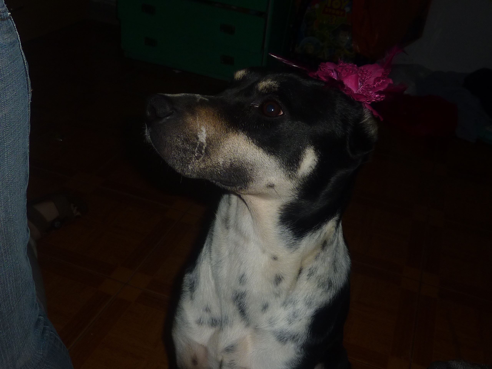
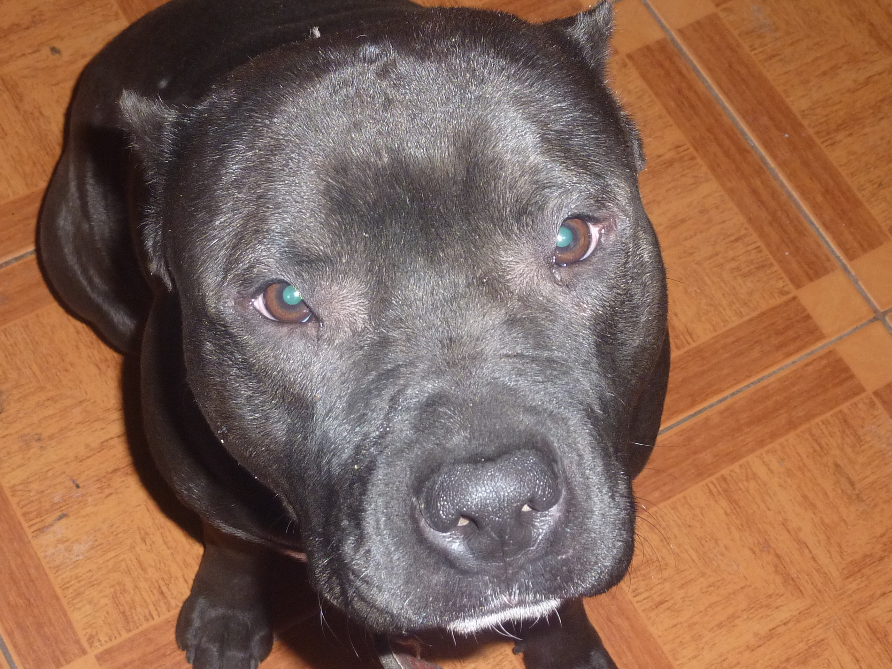

<html>
    <head>
        <link rel="preconnect" href="https://fonts.googleapis.com">
        <link rel="preconnect" href="https://fonts.gstatic.com" crossorigin>
        <link href="https://fonts.googleapis.com/css2?family=Island+Moments&family=Roboto:ital,wght@1,100&display=swap" rel="stylesheet">
        

        <link href="https://cdn.jsdelivr.net/npm/bootstrap@5.1.3/dist/css/bootstrap.min.css" rel="stylesheet" integrity="sha384-1BmE4kWBq78iYhFldvKuhfTAU6auU8tT94WrHftjDbrCEXSU1oBoqyl2QvZ6jIW3" crossorigin="anonymous">
        <title> Mi pagina</title>

        <link rel="stylesheet" href="css/style.css">

     </head>

    <body>
        <header>
         <nav class="navbar navbar-expand-lg navbar-dark bg-dark">
            

              <a class="navbar-brand" href="#">MI Pagina</a>
              <button class="navbar-toggler" type="button" data-bs-toggle="collapse" data-bs-target="#navbarSupportedContent" aria-controls="navbarSupportedContent" aria-expanded="false" aria-label="Toggle navigation">
                
              </button>
              

                <ul class="navbar-nav me-auto mb-2 mb-lg-0">
                  <li class="nav-item">
                    <a class="nav-link active" aria-current="page" href="#">Home</a>
                  </li>
                  <li class="nav-item">
                    <a class="nav-link" href="paginas/pagina 2.html">Link</a>
                  </li>
                  <li class="nav-item dropdown">
                    <a class="nav-link dropdown-toggle" href="#" id="navbarDropdown" role="button" data-bs-toggle="dropdown" aria-expanded="false">
                      Dropdown
                    </a>
                    <ul class="dropdown-menu" aria-labelledby="navbarDropdown">
                      <li><a class="dropdown-item" href="#">Action</a></li>
                      <li><a class="dropdown-item" href="#">Another action</a></li>
                      <li>
</li>
                      <li><a class="dropdown-item" href="#">Something else here</a></li>
                    </ul>
                  </li>
                  <li class="nav-item">
                    <a class="nav-link disabled">Disabled</a>
                  </li>
                </ul>
                <form class="d-flex">
                  <input class="form-control me-2" type="search" placeholder="Search" aria-label="Search">
                  <button class="btn btn-outline-success" type="submit">Buscar</button>
                </form>
              

            

          </nav>
          <h1>Bienvenidos a...
             <i class="fa-solid fa-champagne-glasses"></i>
          </h1>
        </header>
        <main>
           <section>
            

               

                 

                   
                 

                 

                   
                 

                 

                   
                 

               

               <button class="carousel-control-prev" type="button" data-bs-target="#carouselExampleControls" data-bs-slide="prev">
                 
                 Previous
               </button>
               <button class="carousel-control-next" type="button" data-bs-target="#carouselExampleControls" data-bs-slide="next">
                 
                 Next
               </button>
             

           </section>
         

            <h2 class="primerclass">
            Mi Pagina web </h2>  
           <h3>  ACERCA DE MI</h3> 
           
ES UN GUSTO  CONOCERLOS    

          <h3>Datos</h3>    <!--hay hasta 6 h-->
          <ul class="Datos">
             <li> <strong>Nombres</strong>: <em>Numa Martin</em> </li>
             <li>Apellidos:Zuniga Alvarez</li>
             <li>Edad:17</li>
          </ul>
         
  
          <h4><i>Aficiones </i></h4>
           <OL>
             <li> futbol</li> <i class="fas fa-futbol"></i>
             <li>cocina</li>     <!--ul lista desordenada y ol lista ordenada /lorem te tira palabras al azar para un texto dentro de la p  -->
             <li>programacion</li>
             <li>musica </li>
          </OL>
          

                 
            <h3>En donde vivo</h3>
              <iframe src="https://www.google.com/maps/embed?pb=!1m18!1m12!1m3!1d13132.580884402545!2d-58.3923897224382!3d-34.625770280064835!2m3!1f0!2f0!3f0!3m2!1i1024!2i768!4f13.1!3m3!1m2!1s0x95bccb2520946ad7%3A0x531f8f8d460384ad!2sConstituci%C3%B3n%2C%20CABA!5e0!3m2!1ses-419!2sar!4v1641589751967!5m2!1ses-419!2sar" width="600" height="450" style="border:0;" allowfullscreen="" loading="lazy"></iframe>

          <h3>
             <a href="https://www.youtube.com/channel/UCqT4VSWtDxSx565IZeLMKTw">Mi canal de musica </a>
          </h3>
          
            
           

              
  buenas,como estan gente
 
         

           

               

                  
hola

               

               

                    
hola mundo

               

               

                
hola mundo como estan

               

          <section class="container">
             

                

                  

                     
                     

                       <h5 class="card-title">Yin</h5>
                       
 Fue la primera mascota de la famila,es mestiza y es hembra  

                       <a href="#" class="btn btn-primary">Acariciar</a>
                     

                   

                

                

                  

                     
                     

                       <h5 class="card-title">tyson</h5>
                       
Fue el segundo integrante de la famila despues de yin,ya que mi padre queria un pitbull,para cuidar la casa,es pitbull y es macho

                       <a href="#" class="btn btn-primary">Acariciar</a>
                     

                   

                

                

                  

                     
                     

                       <h5 class="card-title">nikita</h5>
                       
Esta preciosa es el fruto del amor de los anteriores presentados,es nena.

                       <a href="#" class="btn btn-primary">Acariciar</a>
                     

                   

                

             

          </section>
       
          <form class="container">
            

              <label for="exampleInputEmail1" class="form-label">Email address</label>
              <input type="email" class="form-control" id="exampleInputEmail1" aria-describedby="emailHelp">
              
We'll never share your email with anyone else.

            

            

              <label for="exampleInputPassword1" class="form-label">Password</label>
              <input type="password" class="form-control" id="exampleInputPassword1">
            

            

              <input type="checkbox" class="form-check-input" id="exampleCheck1">
              <label class="form-check-label" for="exampleCheck1">Check me out</label>
            

            <button type="submit" class="btn btn-primary">Submit</button>
          </form>
       
         </main>

       <footer>
          <a href="https://www.linkedin.com/in/martin-zuniga-22a9191ba/"><i class="fab fa-linkedin"></i>Linkedin</a>
           
          <a href="https://www.facebook.com/profile.php?id=100038176899124"><i class="fab fa-facebook-square"></i>Facebook</a>
           
          <a href="https://www.instagram.com/marto2204/?hl=es"><i class="fab fa-instagram"></i>Intagram</a>

          
       </footer>
       
       </body>
<!--los div sirven para divir el codigo-->
</html>
